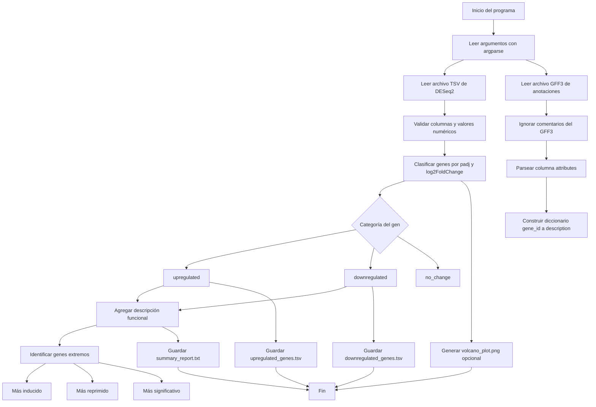

<!--
── Uso de IA ───────────────────────────────────────────────
Herramienta : ChatGPT
Prompt usado: "Te paso la descripción de mi flujo: el programa inicia leyendo
argumentos de línea de comandos, incluyendo las rutas del TSV de DESeq2, el GFF3,
los umbrales de significancia y el directorio de salida. Después carga el TSV con
los resultados de expresión diferencial y el GFF3 con las anotaciones funcionales.
A partir del GFF3 se extraen Name y description de attributes para construir un
diccionario de anotaciones. Luego se clasifica cada gen como upregulated,
downregulated o no_change según padj y log2FoldChange. Finalmente se agregan
anotaciones funcionales a los genes significativos, se identifican genes extremos,
se guardan upregulated_genes.tsv, downregulated_genes.tsv y summary_report.txt,
y opcionalmente se genera un volcano plot. Con base en esto, ayúdame a convertirlo
en un diagrama de flujo Mermaid."
Qué generó  : Un diagrama Mermaid que representa el flujo general del programa.
Qué modifiqué: Revisé que el diagrama coincidiera con mi código y con los pasos
de mi proyecto.
────────────────────────────────────────────────────────────
-->

# Diagrama de flujo del proyecto

## Descripción breve del flujo

El programa inicia leyendo los argumentos de línea de comandos, incluyendo las rutas del archivo TSV de DESeq2, el archivo GFF3, los umbrales de significancia y el directorio de salida. Después, carga el TSV con los resultados de expresión diferencial y el GFF3 con las anotaciones funcionales.

A partir del GFF3 se extraen los campos `Name` y `description` de la columna `attributes`, construyendo un diccionario que relaciona cada gen con su descripción. Luego, cada gen del archivo DESeq2 se clasifica como `upregulated`, `downregulated` o `no_change` según los umbrales de `padj` y `log2FoldChange`.

Finalmente, el programa agrega anotaciones funcionales a los genes significativos, identifica los genes extremos, guarda los archivos `upregulated_genes.tsv`, `downregulated_genes.tsv` y `summary_report.txt`, y opcionalmente genera un volcano plot.
